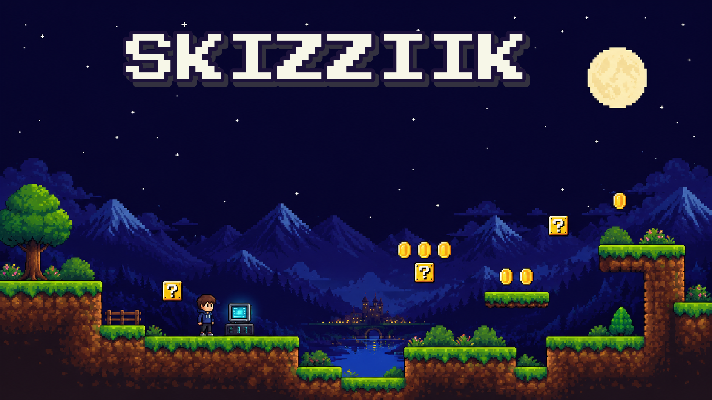
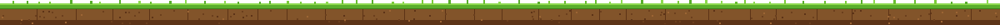
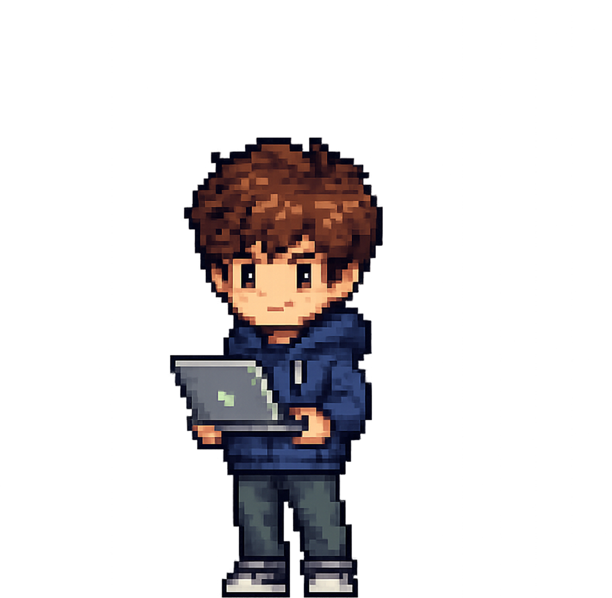
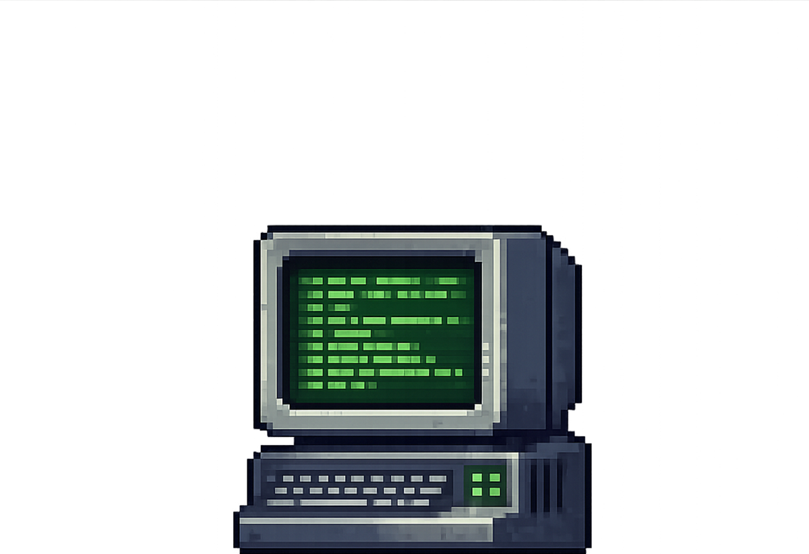
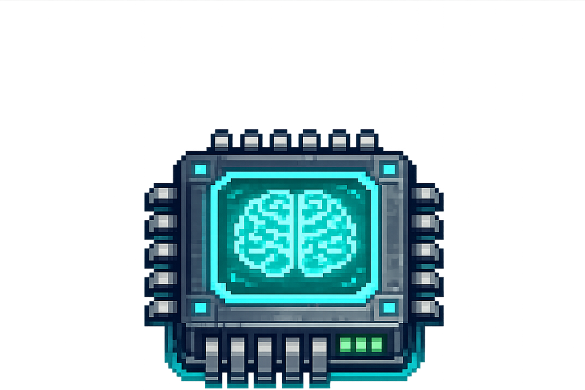
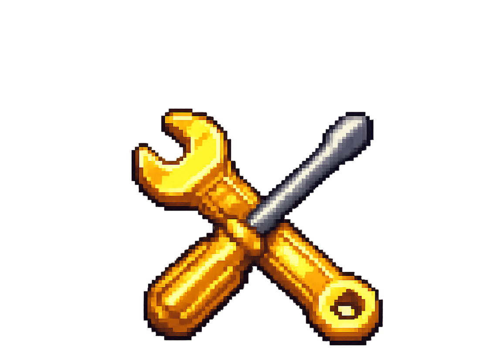
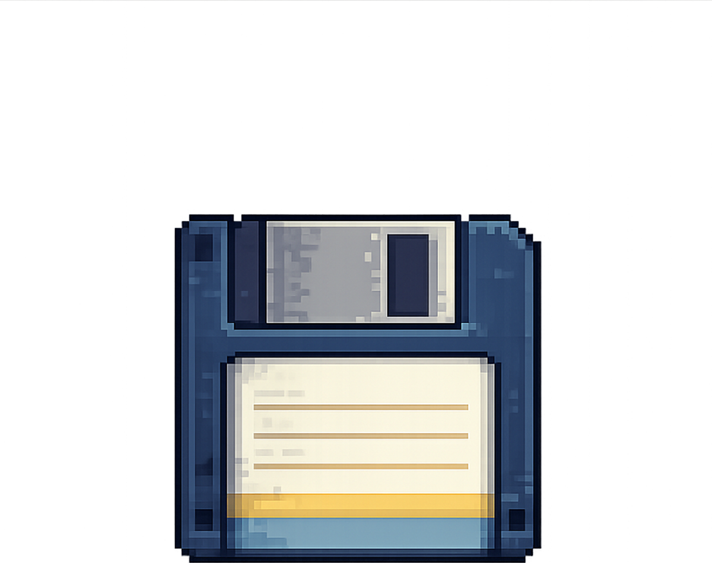
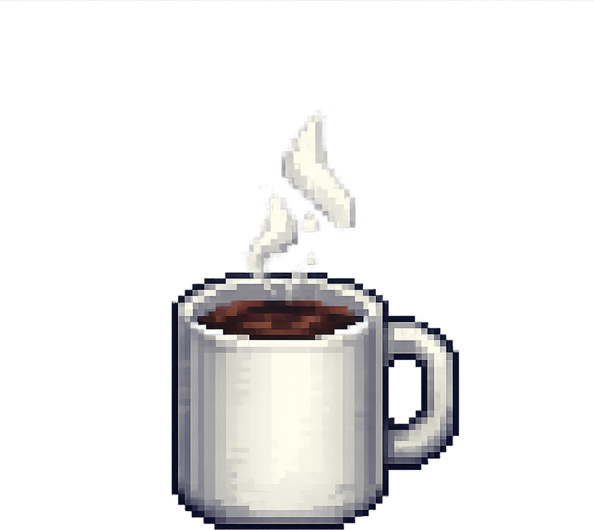
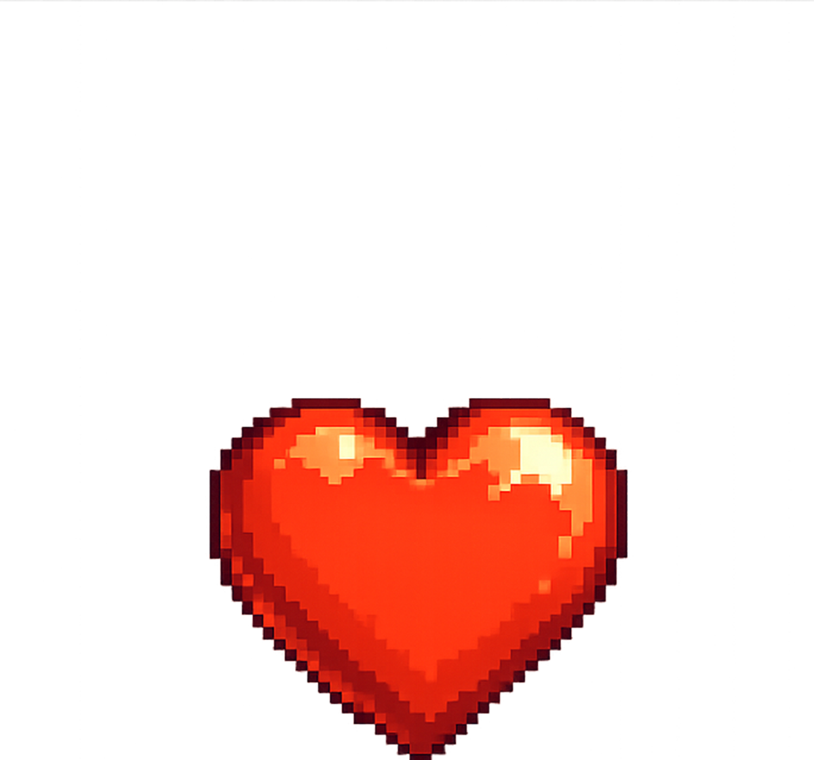
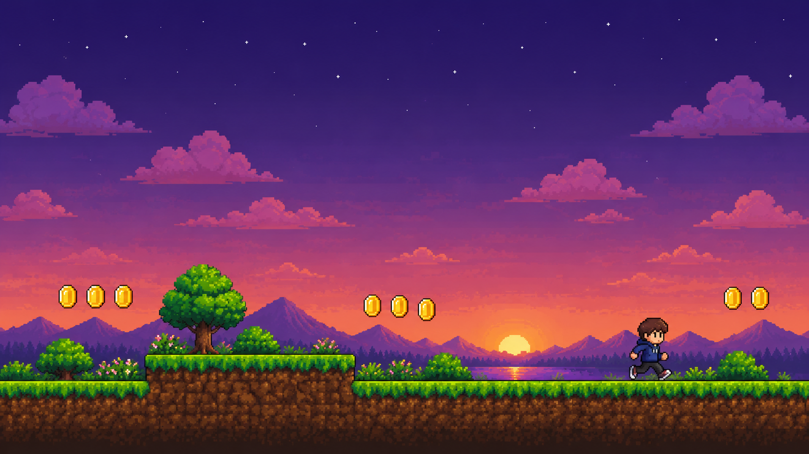

<!-- ======================= TITLE SCREEN ======================= -->


<div align="center">


<br/>


&nbsp;


</div>



<!-- ======================= PLAYER 1 ======================= -->
<div align="center">

</div>

<table>
<tr>
<td width="34%" align="center">

</td>
<td width="66%">

```text
┌─────────────────────────────────────┐
│  PLAYER:  Skizziik (Maksim)          │
│  LVL:     99   ★ vibe-coder          │
│  CLASS:   Founder / Builder          │
│  WORLD:   Rome, Italy                │
│  QUEST:   Building Tryll Engine      │
│  WEAPONS: Claude Code + Codex        │
│  PASSIVE: idea -> AI -> ship -> loop │
│  STATUS:  always shipping, never AFK │
└─────────────────────────────────────┘
```

</td>
</tr>
</table>


<!-- ======================= INVENTORY ======================= -->
<div align="center">

</div>

<table align="center">
<tr>
<td align="center" width="120"><br/><sub>TERMINAL</sub></td>
<td align="center" width="120"><br/><sub>AI CORE</sub></td>
<td align="center" width="120"><br/><sub>TOOLS</sub></td>
<td align="center" width="120"><br/><sub>SHIP IT</sub></td>
<td align="center" width="120"><br/><sub>FUEL</sub></td>
</tr>
</table>

<div align="center">


</div>


<!-- ======================= HIGH SCORE ======================= -->
<div align="center">


<br/>




&nbsp;&nbsp;
 <b>× ∞</b>

<br/><br/>


</div>


<!-- ======================= WORLD MAP ======================= -->
<div align="center">


<br/>


</div>


<!-- ======================= THE SNAKE GAME ======================= -->
<div align="center">


<br/>

<picture>
  <source media="(prefers-color-scheme: dark)" srcset="https://raw.githubusercontent.com/Skizziik/Skizziik/output/github-contribution-grid-snake-dark.svg" />
  <source media="(prefers-color-scheme: light)" srcset="https://raw.githubusercontent.com/Skizziik/Skizziik/output/github-contribution-grid-snake.svg" />
  
</picture>

</div>


<!-- ======================= JOIN THE PARTY ======================= -->
<div align="center">


<br/>

[](https://t.me/makevichmax)
[](https://linkedin.com/in/makevich-maksim)
[](https://tryllengine.com)
[](https://instagram.com/makevichmax)

</div>

<br/>

<!-- ======================= GAME OVER / FOOTER ======================= -->


<div align="center">

</div>
